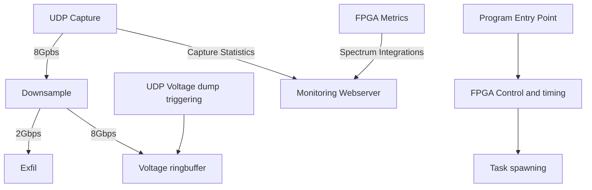

# GReX-T0

First stage processing for the GReX Telescope.

## Structure

This program does quite a bit, depicted by the following chart. Each task has its own thread and is pinned to CPU cores, although the average load per core should be less than 80%.
Tokio handles the less critical async tasks, such as waiting for the dump signal and hosting the metrics webserver.
More implementation details to come.

## Usage

For GReX - the default command line args should be sufficient, but use the `--help` argument to list them all.
