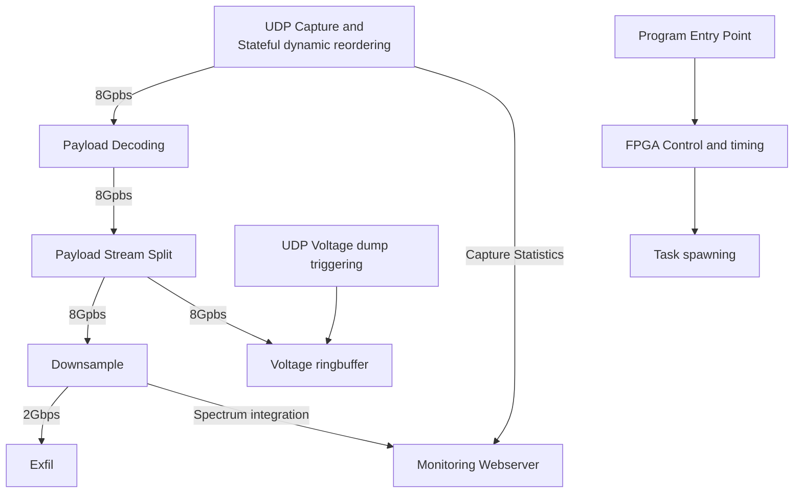

# GReX-T0

First stage processing for the GReX Telescope.

## Structure

This program does quite a bit, depicted by the following chart. Each task has its own thread and is pinned to CPU cores, although the average load per core should be less than 80%. More implementation details to come.



## Usage

For GReX - the default command line args should be sufficient, but the help is listed here as well.

```
Usage: grex_t0 [OPTIONS] [COMMAND]

Commands:
  psrdada     Use PSRDADA for exfil
  filterbank  
  help        Print this message or the help of the given subcommand(s)

Options:
      --core-range <CORE_RANGE>
          CPU cores to which we'll build tasks. They should share a NUMA node [default: 8:15]
      --cap-port <CAP_PORT>
          Port which we expect packets to be directed to [default: 60000]
      --trig-port <TRIG_PORT>
          Port which we expect to receive trigger messages [default: 65432]
      --metrics-port <METRICS_PORT>
          Port to respond to prometheus requests for metrics [default: 8083]
  -d, --downsample-power <DOWNSAMPLE_POWER>
          Downsample power of 2, up to 9 (as that's the size of the capture window) [default: 2]
  -v, --vbuf-power <VBUF_POWER>
          Voltage buffer size as a power of 2 [default: 15]
      --fpga-addr <FPGA_ADDR>
          Socket address of the SNAP Board [default: 192.168.0.5:69]
      --ntp-addr <NTP_ADDR>
          NTP server to synchronize against [default: time.google.com]
      --trig
          Force a pps trigger
      --requant-gain <REQUANT_GAIN>
          Requantization gain [default: 2]
  -h, --help
          Print help information
  -V, --version
          Print version information
```

## TODO
- Exfil to sigproc
- fix gateware to support retriggering